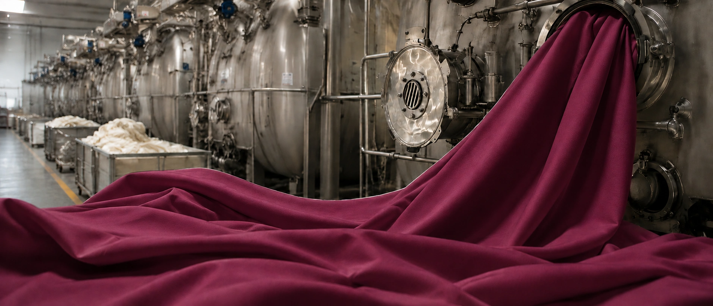
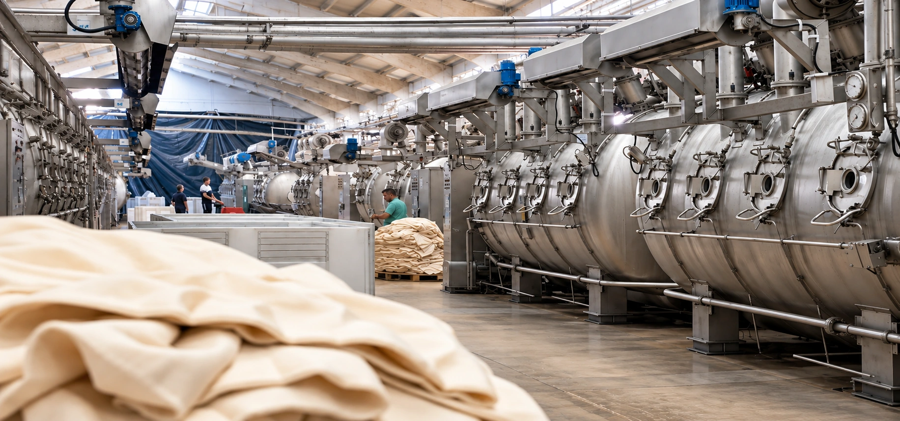
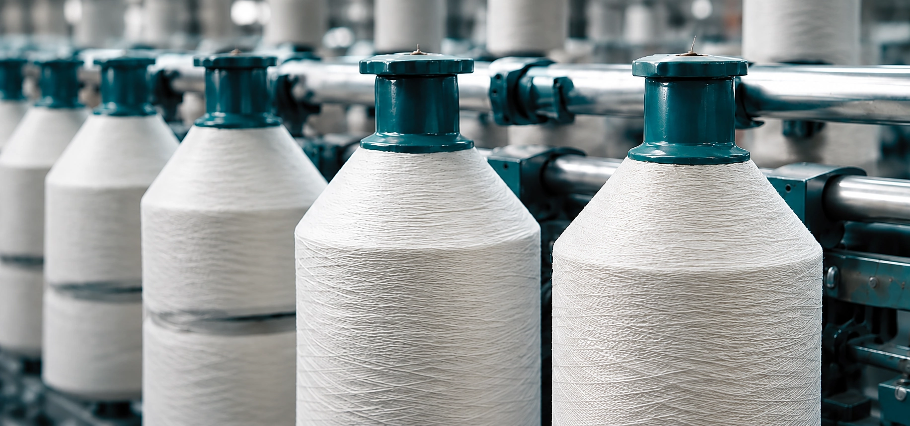
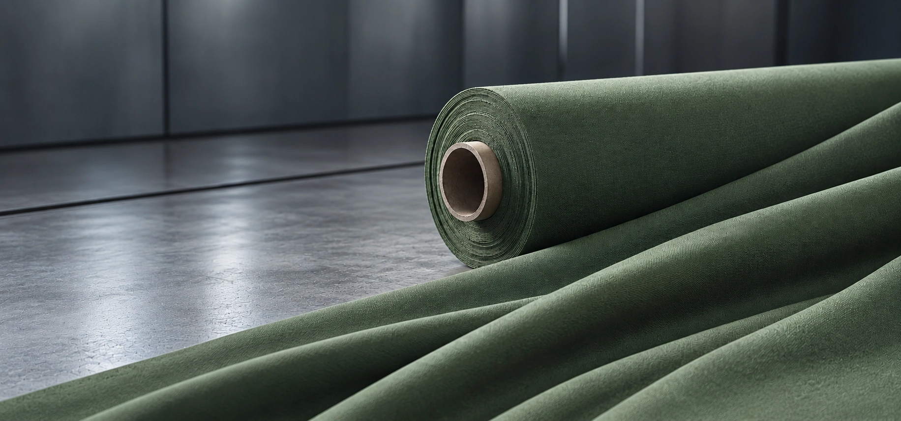
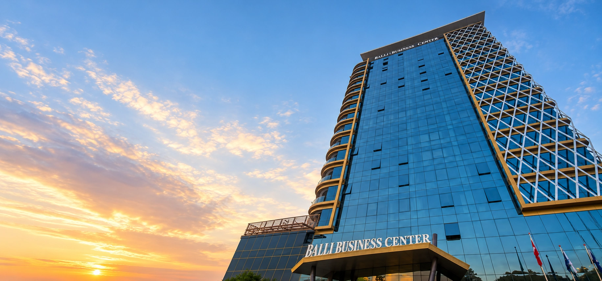
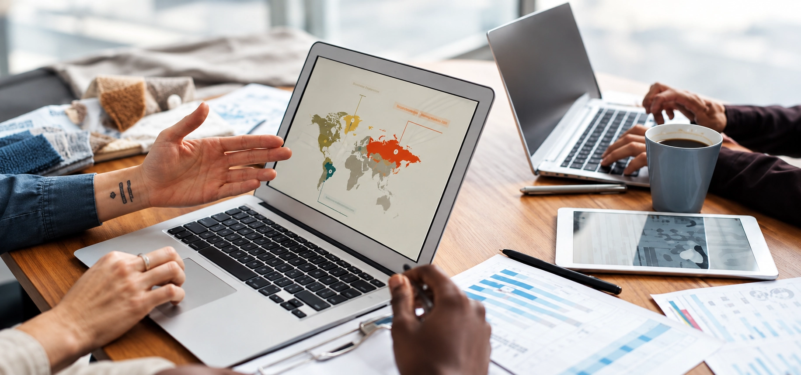
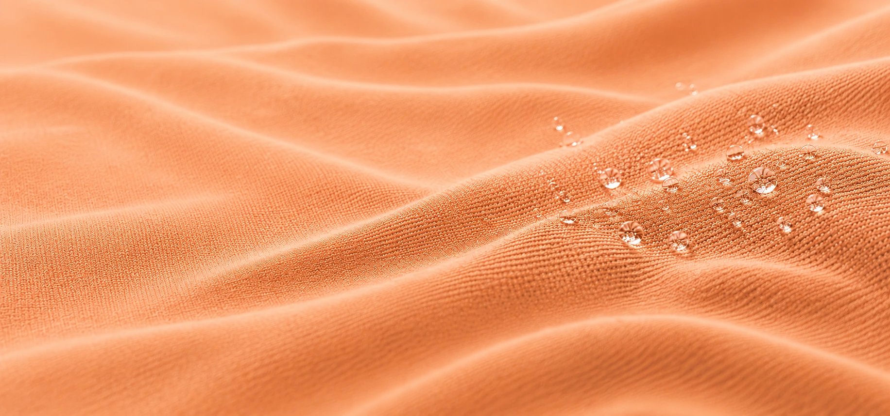

# UNACHEM — Corporate Website

A modern, responsive corporate website designed and developed for **UNACHEM**, a global trading company specializing in textile chemicals and raw materials.

The website was created to present UNACHEM's products, services, markets, and international business activities through a professional and user-friendly digital experience.

## 🌐 Live Website

**[Visit UNACHEM Website](https://unachemicals.com/)**

---

## 📌 Project Overview

UNACHEM operates in the international textile chemicals and raw materials trading industry, connecting suppliers and customers across multiple markets.

The goal of this project was to create a professional corporate website that communicates the company's international presence while providing a clear and accessible experience across desktop, tablet, and mobile devices.

The website includes multilingual content and responsive layouts optimized for different screen sizes.

---

## ✨ Key Features

* Responsive design for desktop, tablet, and mobile
* Modern corporate UI/UX
* Multilingual website structure
* Product and service presentation
* International markets section
* Contact and inquiry sections
* Responsive navigation and header
* Custom page layouts
* Interactive sliders and visual sections
* Mobile-friendly content structure
* Performance and usability considerations

---

## 🛠️ Technologies & Tools

* **WordPress**
* **Elementor**
* **Elementor Pro**
* **WPML**
* **Slider Revolution**
* **HTML5**
* **CSS3**
* **Responsive Web Design**
* **The7 / Betheme ecosystem**

---

## 🎨 Design Approach

The visual design focuses on a clean and professional corporate identity suitable for an international B2B company.

### Design principles

* Clear visual hierarchy
* Consistent spacing and typography
* Strong call-to-action elements
* Responsive layouts
* Professional color palette
* Easy navigation
* Consistent desktop and mobile experience

The primary visual language combines dark neutral tones with UNACHEM's brand colors to create a professional and recognizable interface.

---

## 📱 Responsive Design

The website was designed and tested across different screen sizes to provide a consistent user experience.

### Desktop

Designed for large-screen layouts with structured content sections, responsive containers, navigation, and visual elements.

### Tablet

Layouts were adapted to intermediate screen sizes while maintaining readable typography, spacing, and navigation.

### Mobile

The mobile experience was optimized for smaller screens with responsive sections, mobile navigation, appropriately scaled images, and touch-friendly elements.

---

## 🌍 Multilingual Website

The website uses **WPML** to support multilingual content and provide localized versions of the website.

The multilingual structure allows the company to communicate with international customers across different markets.

---

## 💼 My Role

**WordPress Developer & Web Designer**

My responsibilities included:

* Website structure and page layout
* UI/UX implementation
* WordPress development
* Elementor page building
* Responsive design
* Custom CSS adjustments
* Header and navigation implementation
* Slider and visual section configuration
* Multilingual implementation
* Cross-device layout adjustments
* Website troubleshooting and optimization
* Final visual refinements

---

## 📸 Project Preview

### Homepage & Hero

### Textile & Industrial Sections

### Business & Global Trade

### Additional Visual Sections

---

## 🧩 Project Structure

unachem-wordpress-website/
│
├── README.md
│
├── UNACHEM_burgundy_hero_plain_under_400KB.webp
├── ballı_business_center_at_sunset.webp
├── collaborative_global_strategy_meeting.webp
├── industrial_yarn_spools_in_a_textile_mill.webp
├── ivory_satin_orange_dot_swirl.webp
├── morning_light_through_sheer_curtains.webp
├── olive_fabric_roll_in_minimal_warehouse.webp
├── peach_fabric_waves_with_water_droplets.webp
└── textile_factory_machinery_hall.webp

> Note: This repository contains project documentation and visual previews. The complete production website files and private client data are not included.

---

## 🔒 Client & Project Information

This project was developed for a real business client.

For privacy and security reasons, the repository does not contain:

* WordPress database files
* Hosting credentials
* Administrator credentials
* Private client information
* Production configuration files
* Sensitive API keys
* Full production website files

The screenshots and documentation are provided for portfolio and demonstration purposes.

---

## 📈 Project Goals

The main goals of the project were to:

* Establish a professional online presence for UNACHEM
* Present products and services clearly
* Improve the company's digital communication
* Support international customers
* Provide a responsive experience across devices
* Create a scalable WordPress-based website structure

---

## 👩‍💻 Developer

**Sepideh Hayati**

WordPress Developer & Web Designer

Specialized in:

* WordPress
* Elementor
* Responsive Web Design
* UI/UX
* HTML & CSS
* Website Development

---

## 🔗 Links

**Live Website:**
https://unachemicals.com/

**Portfolio:**
https://sepidehhayati.ir/

---

## 📄 License

This repository is intended for portfolio and demonstration purposes.

The website design, content, branding, and other project assets belong to their respective owners.
